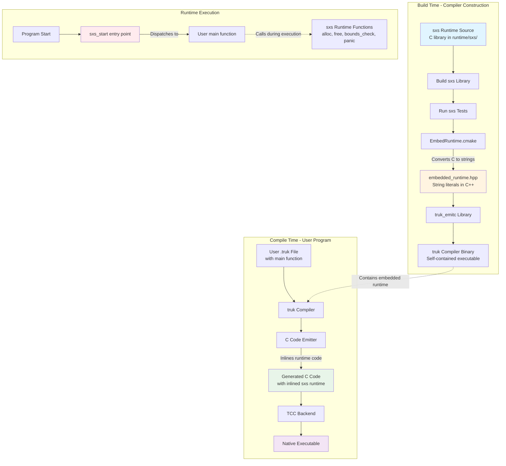
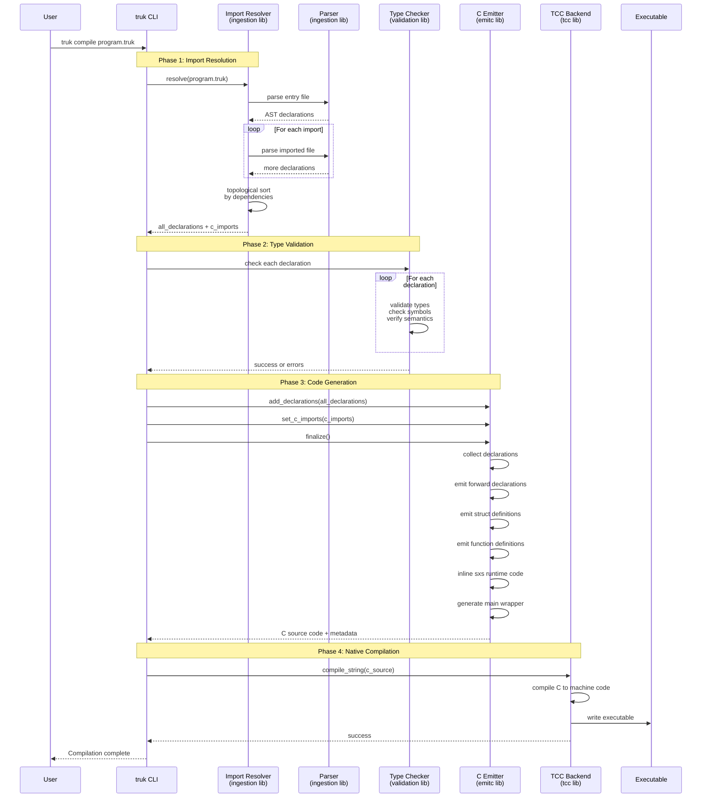
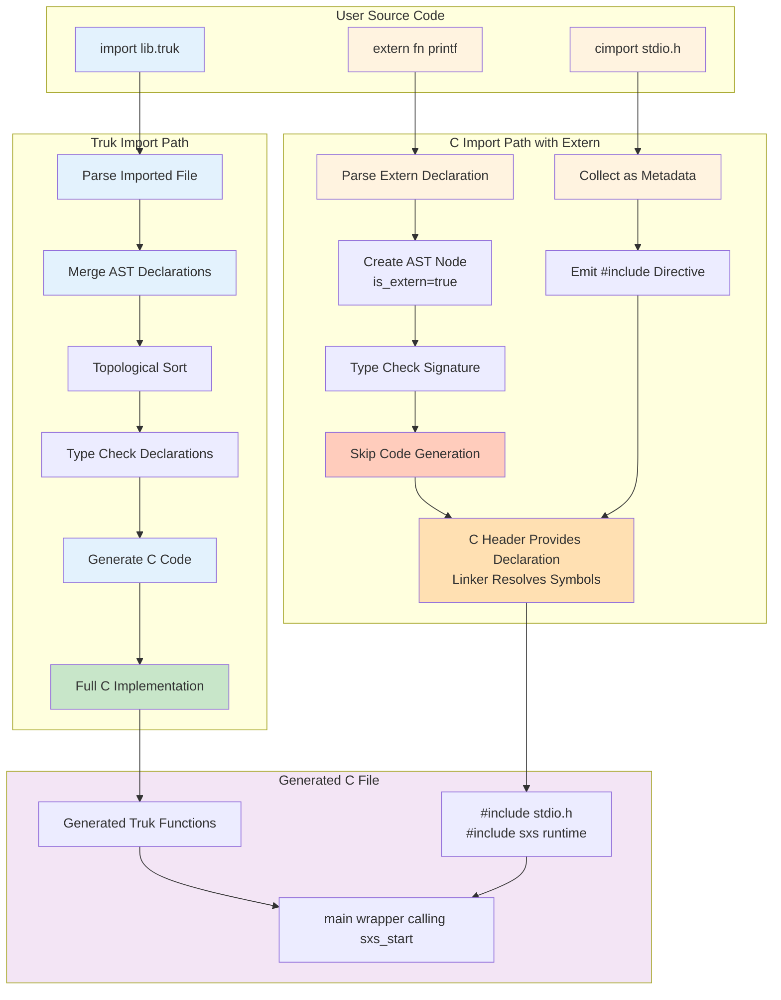
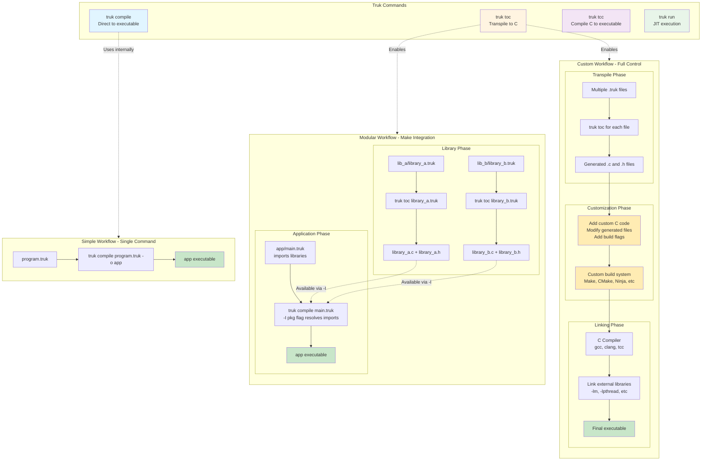

[← Back to Documentation Index](../start-here.md)

# Truk Runtime Architecture

**Language Reference:** [Grammar](grammar.md) · [Builtins](builtins.md) · [Maps](maps.md) · [Defer](defer.md) · [Imports](imports.md) · [Lambdas](lambdas.md) · [Privacy](privacy.md)

---

## Runtime Integration Flow

This diagram shows how the sxs runtime is embedded into the truk compiler and how compiled user code interacts with it.



## Compilation Pipeline Sequence

This diagram shows the complete compilation process through all library components in temporal order.



## Import and Extern Declaration Handling

This diagram shows how truk handles two different import mechanisms and how they flow through compilation.



### Key Differences

**Truk Imports** (`import "file.truk"`):
- Files are fully parsed into AST
- Declarations merged into compilation unit
- Topologically sorted by dependencies
- Type-checked for correctness
- Full C code generated for all declarations
- Result: Complete implementation in generated C

**C Imports** (`cimport <header.h>`):
- Collected as metadata, not parsed
- Emitted as `#include` directives at top of C file
- Truk does not process header contents
- Result: Pass-through to C compiler

**Extern Declarations** (`extern fn`, `extern struct`):
- Parsed into AST with `is_extern=true` flag
- Type-checked for signature correctness
- Skipped during code generation
- C header provides actual declaration
- Linker resolves symbols at link time
- Result: Type safety without code duplication

**Why Extern is Necessary:**
Truk doesn't parse C headers, so you must explicitly declare C functions and structs you want to use. The type checker validates your extern declarations match how you use them, but trusts that the C header provides the actual implementation.

## Key Components

### Build Time
- **sxs runtime**: Core C library providing type definitions, memory operations, and safety checks
- **EmbedRuntime.cmake**: CMake script that converts sxs C files into C++ string literals
- **embedded_runtime.hpp**: Generated header containing runtime code as strings
- **truk_emitc**: Library that embeds the runtime and generates C code

### Compile Time Libraries
- **ingestion**: Tokenizes, parses .truk files, resolves imports across files
- **validation**: Type checking, symbol resolution, semantic validation
- **emitc**: Generates C code with inlined sxs runtime
- **tcc**: Tiny C Compiler backend for native code generation

### Runtime Execution
- **sxs_start**: Entry point that receives user's main function
- **sxs runtime functions**: Memory management, bounds checking, panic handling
- All runtime code is inlined directly into generated C - no external dependencies

## Flexible Build Workflows

This diagram shows the different compilation commands and how they enable custom build systems with Make or other build tools.



### Command Overview

**`truk compile`** - All-in-one compilation:
- Parses .truk files
- Resolves imports
- Type checks
- Generates C code
- Compiles to native executable
- Best for: Simple projects, quick iteration

**`truk toc`** - Transpile to C:
- Parses .truk files
- Resolves imports
- Type checks
- Generates C code files
- Automatically detects library vs application:
  - **No main function**: Generates .h and .c (library mode)
  - **Has main function**: Generates single .c file (application mode)
- Stops before native compilation
- Best for: Modular builds, custom build systems, library generation

**`truk tcc`** - Compile C to executable:
- Takes generated C code
- Compiles to native executable using TCC
- Supports linking flags
- Best for: Two-stage builds, custom C integration

**`truk run`** - JIT execution:
- Compiles in memory
- Executes immediately
- No output file
- Best for: Testing, scripting, rapid prototyping

### Use Cases

**Simple Projects:**

```bash
truk compile main.truk -o myapp
```

**Modular Projects with Libraries:**

```makefile
libs:
    truk toc pkg/lib_a/library_a.truk -o build/lib_a/library_a.c
    truk toc pkg/lib_b/library_b.truk -o build/lib_b/library_b.c

apps: libs
    truk compile app/main.truk -o build/app -I pkg
```

**Custom Build Integration:**

```bash
truk toc src/module1.truk -o build/module1.c
truk toc src/module2.truk -o build/module2.c

gcc -O3 build/module1.c build/module2.c custom.c -o myapp -lm
```

**Mixed C and Truk:**

```bash
truk toc truk_code.truk -o generated.c

gcc -c generated.c -o generated.o
gcc -c existing_c_code.c -o existing.o
gcc generated.o existing.o -o final_app -lpthread
```

### Benefits of `toc` Command

**Incremental Builds:**
- Only regenerate changed .truk files
- Make tracks dependencies automatically
- Faster iteration on large projects

**Build System Integration:**
- Works with Make, CMake, Ninja, etc.
- Standard C files fit existing workflows
- Easy to add custom build steps

**Custom Optimization:**
- Apply specific compiler flags per file
- Use different C compilers (gcc, clang, msvc)
- Control linking order and libraries

**Library Distribution:**
- Automatically generates .h headers for public API (when no main function detected)
- Distribute as standard C libraries
- No truk compiler needed for consumers
- Clean separation: declarations in .h, implementation in .c

**Debugging and Inspection:**
- Inspect generated C code
- Use C debuggers (gdb, lldb)
- Understand compilation output
