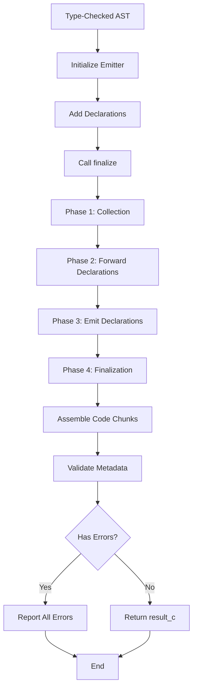

[← Back to Documentation Index](../start-here.md)

# C Emitter Architecture

**Compiler Internals:** [Error Handling](error-handling.md) · [Error Flow Diagrams](error-flow-diagram.md) · [Type Checker](typechecker.md)

---

## Overview

The C emitter transforms a type-checked AST into valid C code through a multi-phase process. It uses the visitor pattern with specialized registries to track types, variables, and builtin functions, ensuring correct code generation with proper memory safety and scope handling.

## High-Level Process Flow



## Core Components

### emitter_c
The main visitor class that orchestrates code generation. Implements `visitor_if` to traverse the AST and emit C code to output streams (`_functions`, `_header`, `_structs`).

**Key responsibilities:**
- Multi-phase emission coordination
- AST traversal and code generation
- Defer scope management
- Error collection

### type_registry_c
Manages all type-related operations and mappings between Truk types and C types.

**Key responsibilities:**
- Map primitive types to C types (`i32` → `__truk_i32`)
- Generate slice typedefs on demand (`truk_slice_T`)
- Generate map typedefs on demand (`__truk_map_T`)
- Track struct and extern struct names

### variable_registry_c
Tracks variable types to enable correct code generation for slice and map operations.

**Key responsibilities:**
- Register variables with their types
- Query if a variable is a slice or map
- Enable proper bounds checking and map access

### builtin_registry_c
Registry of builtin function handlers using the strategy pattern.

**Builtin handlers:**
- `make` - Allocates memory (malloc + initialization)
- `delete` - Frees memory (free or map_deinit)
- `len` - Returns `.len` field for slices
- `sizeof` - Emits C sizeof expression
- `panic` - Emits panic with message
- `each` - Emits loop with callback inlining
- `va_arg_*` - Emits variadic argument access

### expression_visitor_c
Specialized visitor for expression emission that returns string results rather than emitting to streams, enabling composition of complex expressions.

## Emission Phases

### Phase 1: Collection
Traverse all declarations to collect metadata:
- Function names
- Struct names (including extern structs)

This phase sets `_collecting_declarations = true` and visits each declaration without generating code.

### Phase 2: Forward Declarations
Reserved for future use. Currently a no-op (`emit_forward_declarations()` is empty).

### Phase 3: Declaration Emission
Visit each declaration and generate C code:
- **Functions**: Generate function signatures and bodies with defer scope management
- **Structs**: Generate typedef and struct definitions
- **Variables**: Generate variable declarations with proper types
- **Lambdas**: Generate static lambda functions with forward declarations

Code is emitted to three output streams:
- `_header` - Forward declarations and lambda signatures
- `_structs` - Struct definitions and typedefs
- `_functions` - Function definitions and global variables

### Phase 4: Finalization
Assemble the final output:
1. Build header section with system includes, runtime types, and macros
2. Process C imports (filter duplicate system includes)
3. Embed SXS runtime implementation
4. Embed map implementation
5. Add base slice type
6. Assemble chunks: header → structs → declarations → functions
7. Build metadata (function count, struct count, main detection)
8. Validate constraints (e.g., no shards in main file)

## Defer Statement Handling

Defer statements are managed through a scope stack:

**Scope Types:**
- `FUNCTION` - Function scope
- `LAMBDA` - Lambda scope
- `LOOP` - Loop scope (for/while)
- `BLOCK` - Block scope

**Emission Rules:**
- Defers are registered in the current scope when encountered
- Defers are emitted in reverse order (LIFO) at scope exit
- `return` emits all defers from current scope up to function scope
- `break`/`continue` emit all defers from current scope up to loop scope
- Normal scope exit emits only that scope's defers

## Type System Integration

The emitter handles various type mappings:

**Primitives:**
- `i8`, `i16`, `i32`, `i64` → `__truk_i8`, `__truk_i16`, `__truk_i32`, `__truk_i64`
- `u8`, `u16`, `u32`, `u64` → `__truk_u8`, `__truk_u16`, `__truk_u32`, `__truk_u64`
- `f32`, `f64` → `__truk_f32`, `__truk_f64`
- `bool` → `__truk_bool`
- `void` → `__truk_void`

**Complex Types:**
- **Slices**: Unsized arrays generate `truk_slice_T` typedef with `.data` and `.len` fields
- **Maps**: Generate `__truk_map_T` typedef using SXS map implementation
- **Pointers**: Append `*` to pointee type
- **Fixed Arrays**: Emit as C arrays with size
- **Function Pointers**: Emit as C function pointer syntax

## Memory Safety Features

### Slice Bounds Checking
Slice indexing operations include runtime bounds checks:
```c
({ __truk_runtime_sxs_bounds_check(idx, slice.len); slice.data[idx]; })
```

### Map Access Safety
Map operations use the SXS map library with proper error handling:
```c
__truk_map_get(&map, key)
__truk_map_set_(&map.base, key, &map.tmp, sizeof(map.tmp))
```

### Defer Guarantees
Defer statements are emitted at all exit points to ensure cleanup code runs correctly.

## Code Assembly

### Application Assembly
For applications (with main function):
1. Assemble all chunks into single C file
2. Mangle user's `main` to `truk_main_0`
3. Generate wrapper `main` that calls `__truk_runtime_sxs_start`
4. Return single source file

### Library Assembly
For libraries (no main function):
1. Generate header file with:
   - Runtime types
   - Struct definitions
   - Forward declarations (non-static functions only)
2. Generate source file with:
   - Include of header
   - Function implementations
3. Return both header and source

## Error Handling

Errors are collected throughout emission rather than stopping at the first error. Each error includes:
- Error message
- Source node reference
- Source index
- Emission phase
- Node context (e.g., "function 'main'")

This provides comprehensive feedback to the developer.

## Runtime Integration

The emitter embeds the SXS runtime library, which provides:
- **Runtime Types**: Type definitions for all Truk primitives
- **Runtime Functions**: Bounds checking, panic handling, memory allocation
- **Map Implementation**: Complete hash map from `sxs/ds/map.h` and `sxs/ds/map.c`
- **Slice Types**: Base `truk_slice_void` and generated typed slice structs

The runtime is embedded at compile time from files in `runtime/sxs/`, ensuring the generated C code is self-contained and requires no external dependencies beyond the C standard library.
