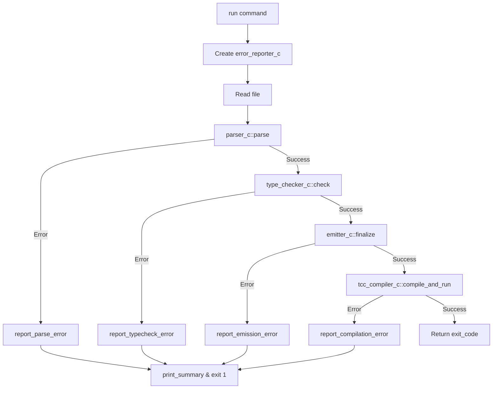
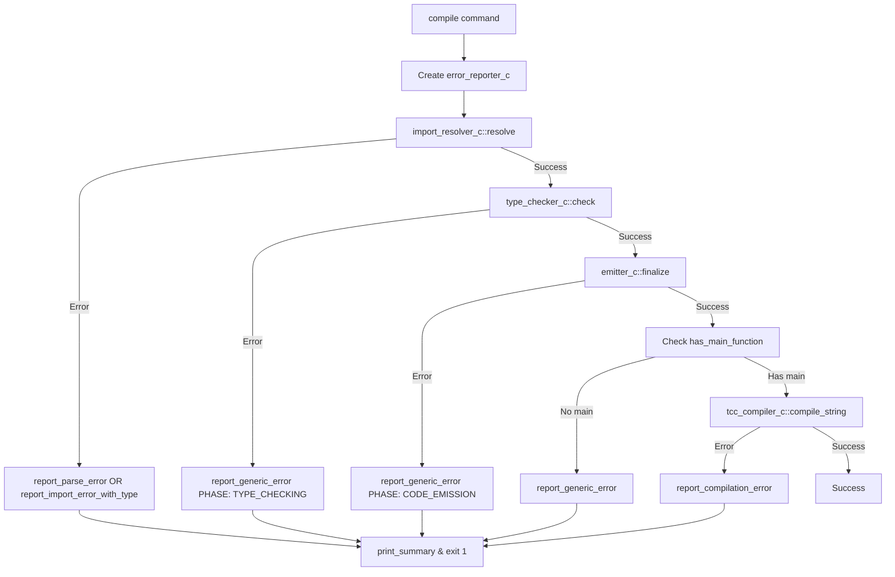
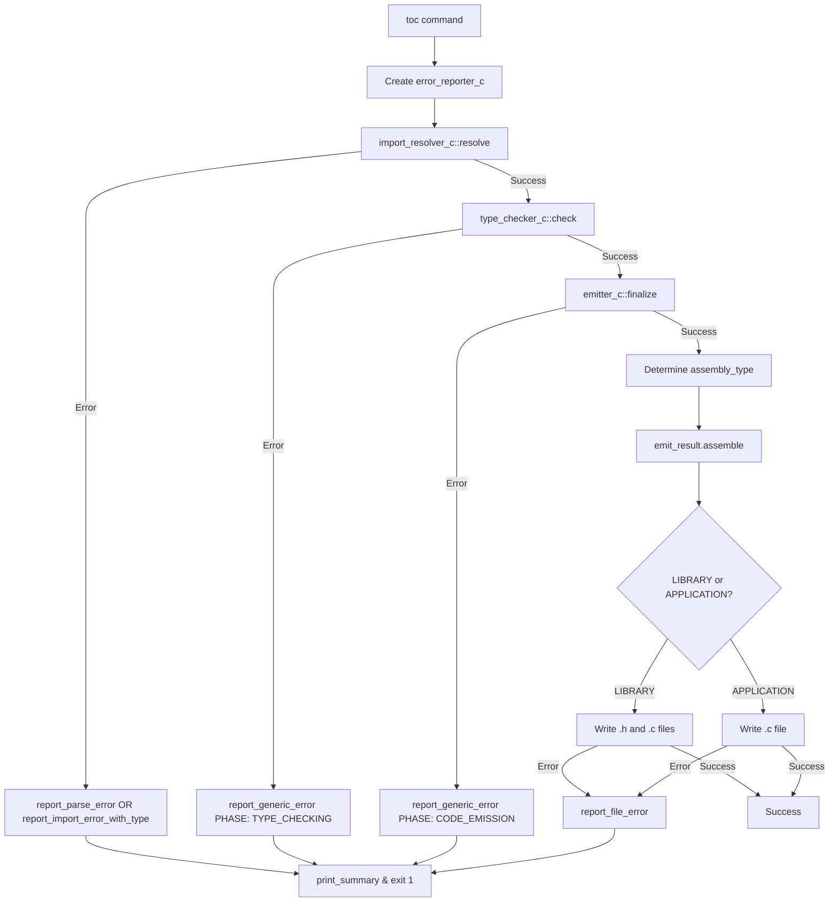
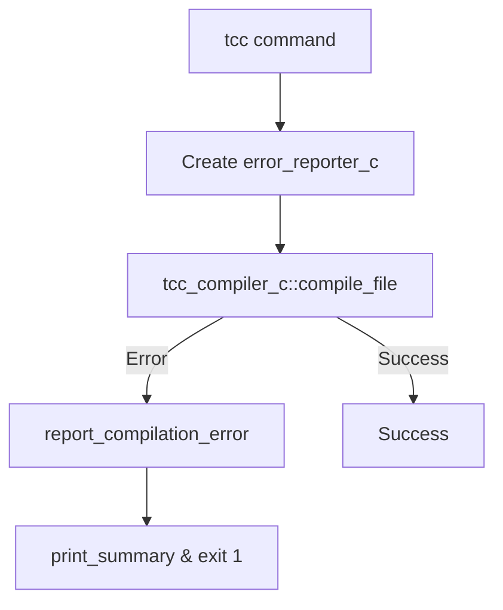

# TRUK Error Flow

## Command: `run`

## Command: `compile`

## Command: `toc`

## Command: `tcc`

## Error Reporter Methods

| Method | Parameters | Used By |
|--------|-----------|---------|
| `report_parse_error` | file, source, line, col, msg | run, compile, toc |
| `report_import_error_with_type` | file, msg, line, col, is_parse | compile, toc |
| `report_typecheck_error` | file, source, source_index, msg | run |
| `report_emission_error` | file, source, source_index, msg, ctx | run |
| `report_compilation_error` | msg | run, compile, tcc |
| `report_file_error` | file, msg | toc |
| `report_generic_error` | phase, msg | compile, toc |

## Error Phases

- `PARSING`
- `IMPORT_RESOLUTION`
- `TYPE_CHECKING`
- `CODE_EMISSION`
- `C_COMPILATION`
- `FILE_IO`
- `UNKNOWN`
