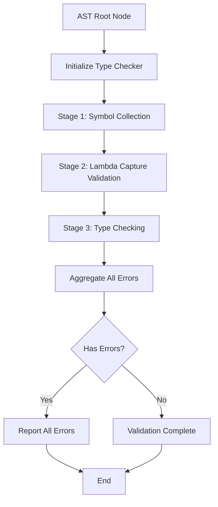
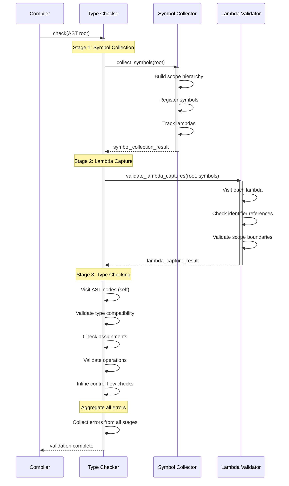
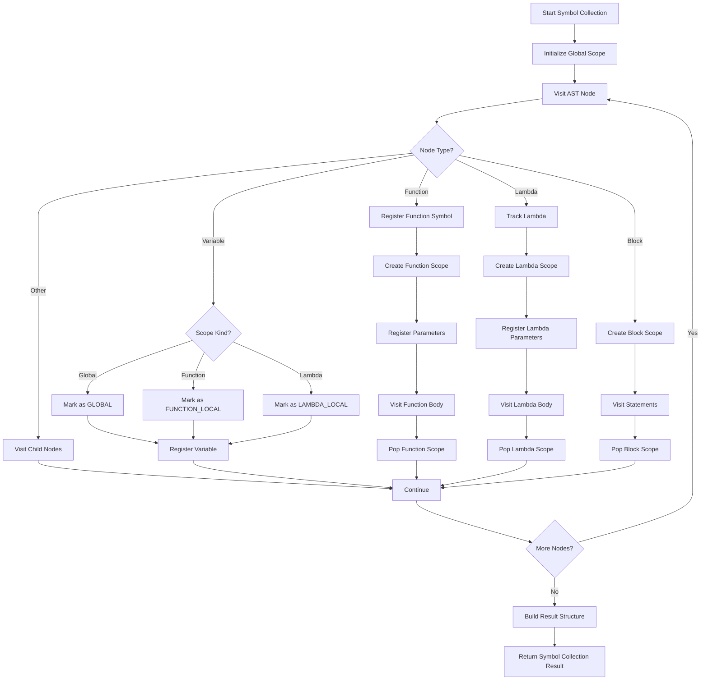
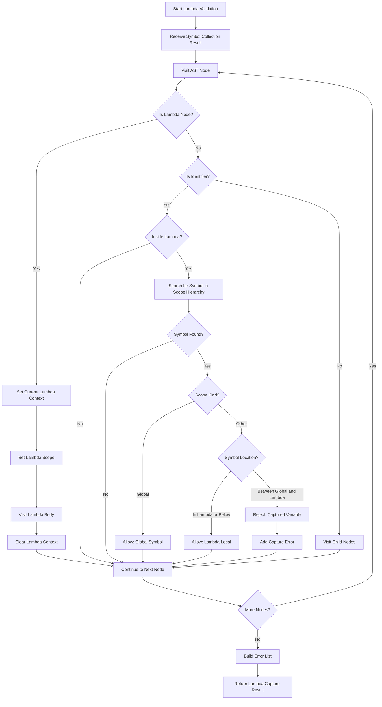
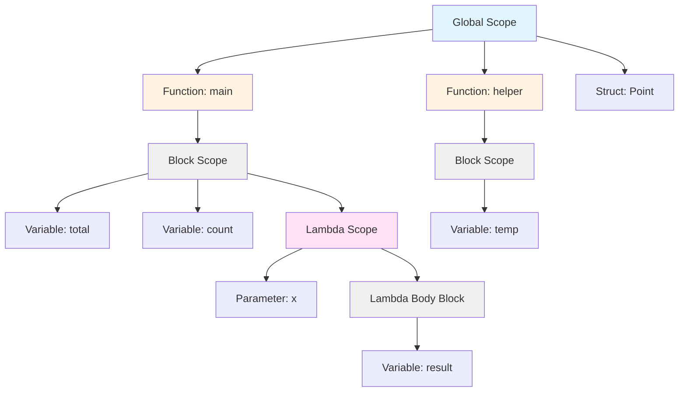
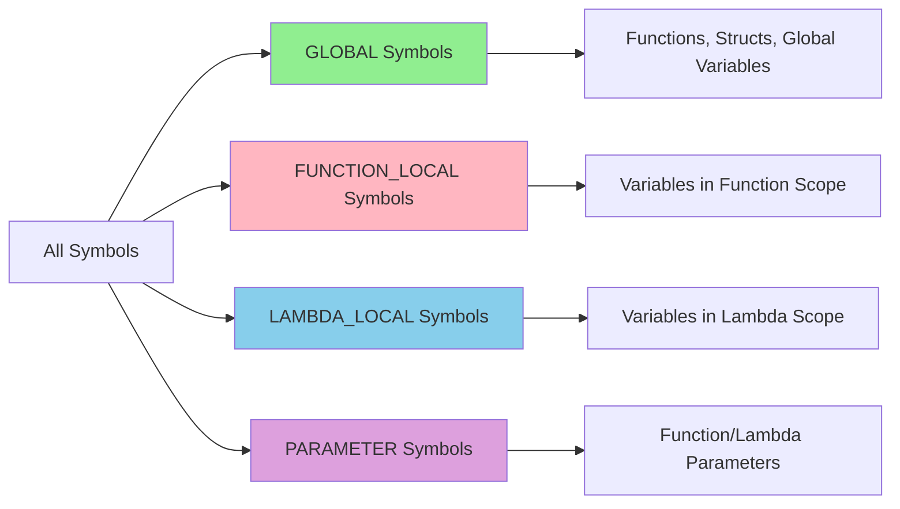
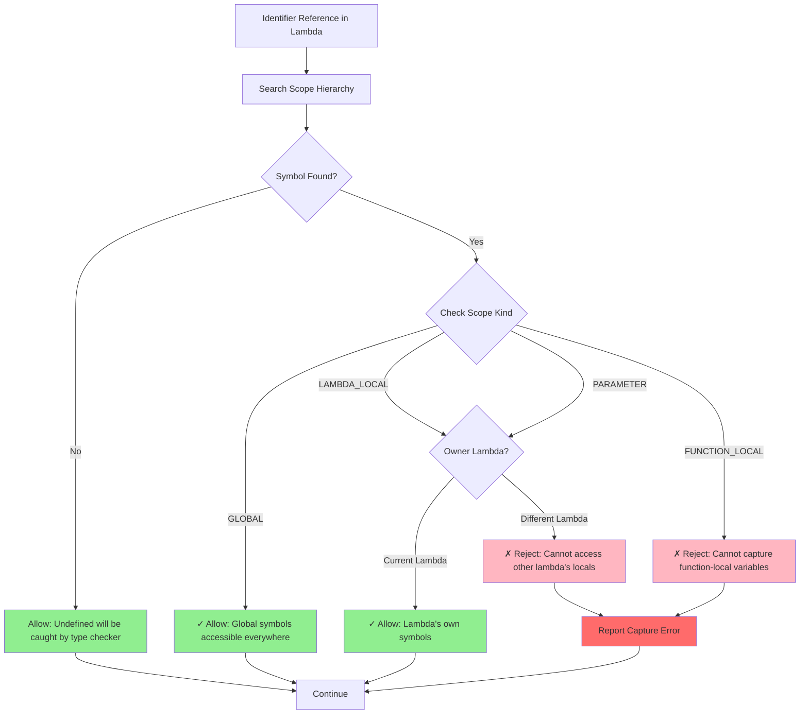
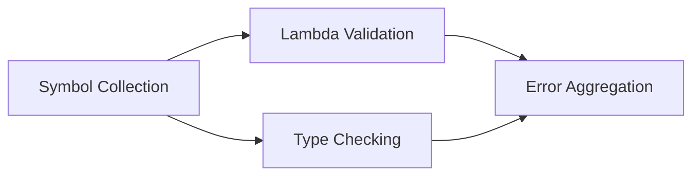
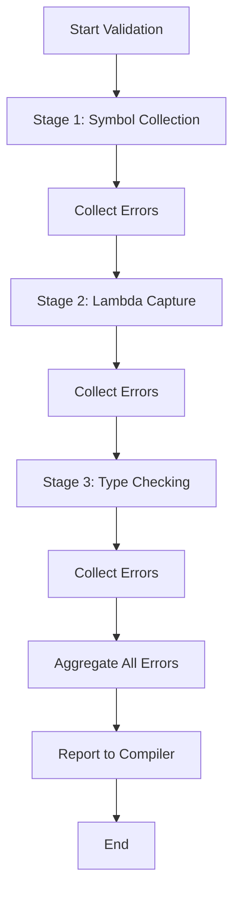

# Type Checker Architecture

## Overview

The type checker implements a multi-stage validation architecture that processes the Abstract Syntax Tree (AST) through distinct phases. The implementation uses three specialized visitor classes and inline control flow checking to provide comprehensive validation. Each stage focuses on a specific concern, building upon the results of previous stages.

## High-Level Process Flow

## Multi-Stage Validation Sequence

## Symbol Collection Process

## Lambda Capture Validation Process

## Scope Hierarchy Structure

## Symbol Scope Classification

## Lambda Capture Rules

## Validation Stage Dependencies

## Error Aggregation Flow

## Key Design Principles

### Separation of Concerns
Each validation stage focuses on a single aspect of correctness:
- Symbol collection builds the scope hierarchy
- Lambda validation enforces non-capturing semantics
- Type checking validates type compatibility and performs inline control flow checks

### Visitor Pattern
All stages use the visitor pattern to traverse the AST, allowing clean separation between the AST structure and validation logic. The type checker itself acts as a visitor for type validation.

### Incremental Error Collection
Errors are collected throughout all stages rather than stopping at the first error, providing comprehensive feedback to the developer.

### Scope-Based Validation
The explicit scope hierarchy enables precise validation of symbol visibility and lambda capture rules.

### Inline Control Flow Checking
Control flow validation is performed inline during type checking using the `control_flow_checker_c` helper class. The type checker calls `check_no_control_flow()` and `check_no_break_or_continue()` as needed to validate control flow constraints in specific contexts like defer blocks and lambdas.

## Implementation Architecture

### Visitor Classes

The type checker uses three main visitor classes:

1. **`symbol_collector_c`**: Traverses the AST to build the scope hierarchy and register all symbols. It creates `scope_info_s` structures for functions, lambdas, and blocks, and populates them with `symbol_entry_s` entries. Lambda parameters are correctly classified as `PARAMETER` scope kind.

2. **`lambda_capture_validator_c`**: Validates that lambdas do not capture variables from enclosing scopes. It tracks the current lambda context and checks each identifier reference against the scope hierarchy to ensure only global symbols and lambda-local symbols are accessed.

3. **`type_checker_c`**: The main type checker class acts as its own visitor for type validation. It traverses the AST, validates type compatibility, checks assignments, and validates operations. It uses the `control_flow_checker_c` helper inline when needed.

### Control Flow Checking

Control flow validation is performed inline using the `control_flow_checker_c` helper class. The type checker calls:
- `check_no_control_flow()`: Validates that a code block contains no return, break, or continue statements (used for defer blocks)
- `check_no_break_or_continue()`: Validates that a code block contains no break or continue statements (used for lambda bodies)

This approach is more efficient than a separate analysis stage, as control flow checks are only performed where needed.

## Lambda Capture Validation Rationale

Lambdas in Truk compile to static C functions and cannot capture variables from enclosing scopes. The lambda capture validator enforces this constraint by:

1. Using the complete scope hierarchy built during symbol collection
2. Tracking which lambda context is currently active during validation
3. Checking each identifier reference to determine if it violates capture rules
