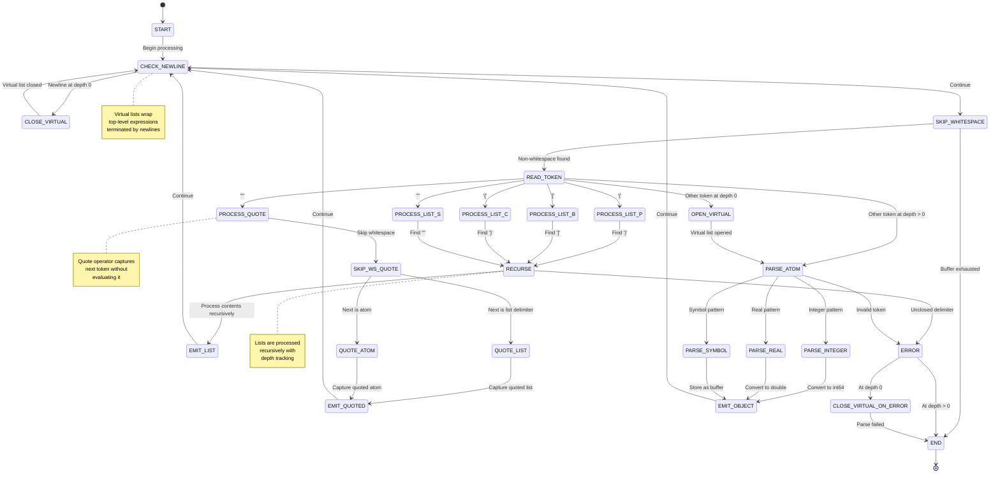

# SLP Parser State Machine

## Key Concepts

**Virtual Lists**: At depth 0, expressions not wrapped in explicit delimiters are automatically wrapped in virtual parentheses, terminated by newlines.

**Recursive Processing**: List delimiters trigger recursive descent into nested content, maintaining depth tracking.

**Quote Operator**: The `'` operator captures the next token (list or atom) as literal data without processing.

**Base Types**: Atoms are classified as integers, reals, or symbols based on their lexical pattern.

**Error Handling**: Parse errors (unclosed delimiters, invalid tokens) transition to ERROR state and halt processing.

