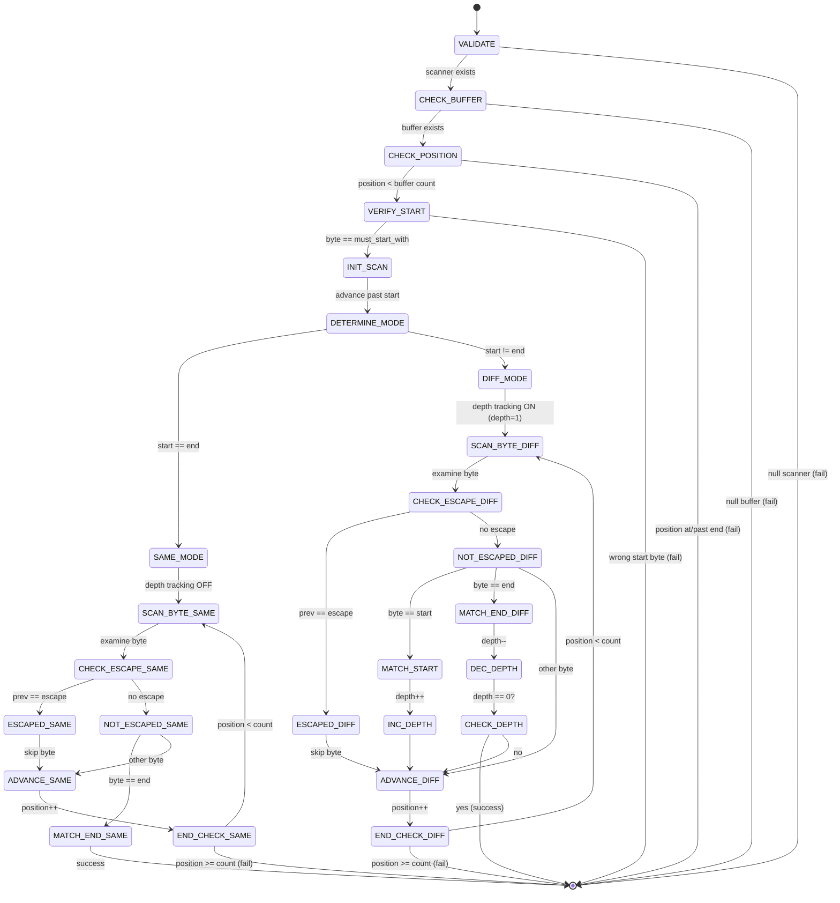

# Group Scanner

## Overview

The group scanner finds matching delimiter pairs in a buffer, handling nested structures and escape sequences. It identifies the boundaries of grouped data and returns the positions of the opening and closing delimiters.

**Supported Patterns:**
- Parentheses, brackets, braces: `()`, `[]`, `{}`
- Quoted strings: `""`, `''`
- Custom delimiter pairs: `!$`, `<>`, `||`
- Any single-byte delimiter combination

## Result Structure

The scanner returns three values:

| Field | Type | Description |
|-------|------|-------------|
| `success` | bool | true if matching group found, false otherwise |
| `index_of_start_symbol` | size_t | Buffer position of opening delimiter |
| `index_of_closing_symbol` | size_t | Buffer position of closing delimiter |

## Delimiter Modes

The scanner operates in two distinct modes based on whether the start and end delimiters are the same byte.

### Mode 1: Different Delimiters (Depth Tracking Enabled)

Used when start and end delimiters differ, such as `(` and `)`.

**Behavior:**
- Tracks nesting depth starting at 1
- Each start delimiter increments depth
- Each end delimiter decrements depth
- Returns when depth reaches 0
- Finds the **matching** closing delimiter, not the first one

**Example:** `(outer(inner))` finds the closing `)` at position 13, not position 12.

### Mode 2: Same Delimiters (No Depth Tracking)

Used when start and end delimiters are identical, such as `"` and `"`.

**Behavior:**
- No depth tracking
- Returns on first unescaped end delimiter
- Used for strings and quoted content

**Example:** `"hello world"` finds the closing `"` at position 12.

## Leading Whitespace Handling

The scanner accepts a `consume_leading_ws` parameter:

**When `true`:**
- Skips all leading whitespace (space, tab, newline, carriage return) before checking for the start delimiter
- The returned `index_of_start_symbol` points to the delimiter, not the whitespace
- Useful when parsing structures with flexible whitespace formatting

**When `false`:**
- Requires the start delimiter at the current scanner position
- No whitespace is consumed
- This is the traditional behavior

**Example:**
- Buffer: `"   (hello)"` at position 0
- With `consume_leading_ws = true`: finds `(` at position 3, succeeds
- With `consume_leading_ws = false`: no `(` at position 0, fails

## Escape Sequences

When an escape byte is provided:
- Any delimiter immediately preceded by the escape byte is ignored
- The escape byte itself has no special meaning except when before a delimiter
- Only the immediate previous byte is checked

**Example with backslash escape:**
- `"hello \"world\""` → closing `"` at position 17 (escaped quotes at 8 and 16 are skipped)
- `(text with \) inside)` → closing `)` at position 20 (escaped `)` at 11 is skipped)

**Without escape byte:**
- All delimiters are significant
- No way to include delimiter in content

## Parsing Rules

### Start Position Validation
1. If `consume_leading_ws` is true, skip all leading whitespace first
2. Scanner position must point to the start delimiter (after whitespace if consumed)
3. If current byte does not match start delimiter, return failure
4. This enforces caller intent and prevents accidental misuse

### Scanning Process

**For Different Delimiters:**
1. Initialize depth counter to 1
2. Advance position past start delimiter
3. For each subsequent byte:
   - Check if escaped (if escape byte provided)
   - If not escaped and matches start delimiter: increment depth
   - If not escaped and matches end delimiter: decrement depth
   - If depth reaches 0: success, return positions
4. If buffer ends before depth reaches 0: failure

**For Same Delimiters:**
1. Advance position past start delimiter
2. For each subsequent byte:
   - Check if escaped (if escape byte provided)
   - If not escaped and matches end delimiter: success, return positions
3. If buffer ends before finding end: failure

### Position Update Behavior

**On Success:**
- `scanner->position` updated to `index_of_closing_symbol`
- Scanner points at the closing delimiter

**On Failure:**
- `scanner->position` unchanged
- Allows caller to retry or recover

## State Machine Diagram



## Frame-by-Frame Parsing Examples

### Example 1: Simple Parentheses `"(hello)"`

| Frame | Position | Byte | Depth | Escaped | Action | Result |
|-------|----------|------|-------|---------|--------|--------|
| 0 | 0 | `'('` | - | - | Verify start, init depth=1 | - |
| 1 | 1 | `'h'` | 1 | No | Not delimiter | - |
| 2 | 2 | `'e'` | 1 | No | Not delimiter | - |
| 3 | 3 | `'l'` | 1 | No | Not delimiter | - |
| 4 | 4 | `'l'` | 1 | No | Not delimiter | - |
| 5 | 5 | `'o'` | 1 | No | Not delimiter | - |
| 6 | 6 | `')'` | 1 | No | End delimiter, depth → 0 | ✓ SUCCESS |

**Result:**
- Success: true
- Start symbol: 0
- Closing symbol: 6
- Scanner position: 6

### Example 2: Nested Parentheses `"(outer(inner))"`

| Frame | Position | Byte | Depth | Action | Result |
|-------|----------|------|-------|--------|--------|
| 0 | 0 | `'('` | - | Verify start, init depth=1 | - |
| 1 | 1 | `'o'` | 1 | Not delimiter | - |
| 2 | 2 | `'u'` | 1 | Not delimiter | - |
| 3 | 3 | `'t'` | 1 | Not delimiter | - |
| 4 | 4 | `'e'` | 1 | Not delimiter | - |
| 5 | 5 | `'r'` | 1 | Not delimiter | - |
| 6 | 6 | `'('` | 1 | Start delimiter, depth → 2 | - |
| 7 | 7 | `'i'` | 2 | Not delimiter | - |
| 8 | 8 | `'n'` | 2 | Not delimiter | - |
| 9 | 9 | `'n'` | 2 | Not delimiter | - |
| 10 | 10 | `'e'` | 2 | Not delimiter | - |
| 11 | 11 | `'r'` | 2 | Not delimiter | - |
| 12 | 12 | `')'` | 2 | End delimiter, depth → 1 | - |
| 13 | 13 | `')'` | 1 | End delimiter, depth → 0 | ✓ SUCCESS |

**Result:**
- Success: true
- Start symbol: 0
- Closing symbol: 13
- Scanner position: 13

**Key Point:** The first `)` at position 12 does not terminate because depth is still 2. Only when depth reaches 0 at position 13 does the scan succeed.

### Example 3: Quoted String with Escapes `"\"hello \\\"world\\\"\""`

Buffer breakdown:
```
Position: 0  1  2  3  4  5  6  7  8  9 10 11 12 13 14 15 16 17
Byte:     "  h  e  l  l  o     \  "  w  o  r  l  d  \  "  "
```

| Frame | Position | Byte | Escaped | Action | Result |
|-------|----------|------|---------|--------|--------|
| 0 | 0 | `'"'` | - | Verify start (same delimiter mode) | - |
| 1 | 1 | `'h'` | No | Not delimiter | - |
| 2 | 2 | `'e'` | No | Not delimiter | - |
| 3 | 3 | `'l'` | No | Not delimiter | - |
| 4 | 4 | `'l'` | No | Not delimiter | - |
| 5 | 5 | `'o'` | No | Not delimiter | - |
| 6 | 6 | `' '` | No | Not delimiter | - |
| 7 | 7 | `'\'` | No | Not delimiter | - |
| 8 | 8 | `'"'` | Yes | Escaped, skip | - |
| 9 | 9 | `'w'` | No | Not delimiter | - |
| 10 | 10 | `'o'` | No | Not delimiter | - |
| 11 | 11 | `'r'` | No | Not delimiter | - |
| 12 | 12 | `'l'` | No | Not delimiter | - |
| 13 | 13 | `'d'` | No | Not delimiter | - |
| 14 | 14 | `'\'` | No | Not delimiter | - |
| 15 | 15 | `'"'` | Yes | Escaped, skip | - |
| 16 | 16 | `'"'` | No | End delimiter | ✓ SUCCESS |

**Result:**
- Success: true
- Start symbol: 0
- Closing symbol: 16
- Scanner position: 16

### Example 4: Deeply Nested `"(a(b(c(d(e)f)g)h)i)"`

| Frame | Position | Byte | Depth | Action | Result |
|-------|----------|------|-------|--------|--------|
| 0 | 0 | `'('` | - | Verify start, init depth=1 | - |
| 1 | 1 | `'a'` | 1 | Not delimiter | - |
| 2 | 2 | `'('` | 1 | Start delimiter, depth → 2 | - |
| 3 | 3 | `'b'` | 2 | Not delimiter | - |
| 4 | 4 | `'('` | 2 | Start delimiter, depth → 3 | - |
| 5 | 5 | `'c'` | 3 | Not delimiter | - |
| 6 | 6 | `'('` | 3 | Start delimiter, depth → 4 | - |
| 7 | 7 | `'d'` | 4 | Not delimiter | - |
| 8 | 8 | `'('` | 4 | Start delimiter, depth → 5 | - |
| 9 | 9 | `'e'` | 5 | Not delimiter | - |
| 10 | 10 | `')'` | 5 | End delimiter, depth → 4 | - |
| 11 | 11 | `'f'` | 4 | Not delimiter | - |
| 12 | 12 | `')'` | 4 | End delimiter, depth → 3 | - |
| 13 | 13 | `'g'` | 3 | Not delimiter | - |
| 14 | 14 | `')'` | 3 | End delimiter, depth → 2 | - |
| 15 | 15 | `'h'` | 2 | Not delimiter | - |
| 16 | 16 | `')'` | 2 | End delimiter, depth → 1 | - |
| 17 | 17 | `'i'` | 1 | Not delimiter | - |
| 18 | 18 | `')'` | 1 | End delimiter, depth → 0 | ✓ SUCCESS |

**Result:**
- Success: true
- Start symbol: 0
- Closing symbol: 18
- Maximum depth reached: 5

### Example 5: Missing End Delimiter `"(hello"`

| Frame | Position | Byte | Depth | Action | Result |
|-------|----------|------|-------|--------|--------|
| 0 | 0 | `'('` | - | Verify start, init depth=1 | - |
| 1 | 1 | `'h'` | 1 | Not delimiter | - |
| 2 | 2 | `'e'` | 1 | Not delimiter | - |
| 3 | 3 | `'l'` | 1 | Not delimiter | - |
| 4 | 4 | `'l'` | 1 | Not delimiter | - |
| 5 | 5 | `'o'` | 1 | Not delimiter | - |
| 6 | 6 | EOF | 1 | End of buffer, depth still 1 | ✗ FAILURE |

**Result:**
- Success: false
- Scanner position: 0 (unchanged)

### Example 6: Wrong Start Delimiter `"[hello)"`

| Frame | Position | Byte | Action | Result |
|-------|----------|------|--------|--------|
| 0 | 0 | `'['` | Looking for `'('`, found `'['` | ✗ FAILURE |

**Result:**
- Success: false
- Scanner position: 0 (unchanged)

## Memory Layout Visualization

### Buffer: `"(add 42 3.14)"`

```
Byte Index:  0   1   2   3   4   5   6   7   8   9  10  11  12
Buffer:     [(] [a] [d] [d] [ ] [4] [2] [ ] [3] [.] [1] [4] [)]
             ^                                                   ^
             |                                                   |
        start_symbol                                     closing_symbol
        index 0                                           index 12
        
        Group boundaries: [0, 12]
        Content region: [1, 11]
```

### Buffer with Nesting: `"(a(b)c)"`

```
Byte Index:  0   1   2   3   4   5   6
Buffer:     [(] [a] [(] [b] [)] [c] [)]
             ^       ^       ^       ^
             |       |       |       |
           depth=1 depth=2 depth=1 depth=0
           
Depth tracking:
  Position 0: depth starts at 1
  Position 2: depth increases to 2
  Position 4: depth decreases to 1
  Position 6: depth decreases to 0 → MATCH
```

### Buffer with Escapes: `"\"a\\\"b\""`

```
Byte Index:  0   1   2   3   4   5   6
Buffer:     ["] [a] [\] ["] [b] ["] 
             ^       ^   ^       ^
             |       |   |       |
           start  escape |    closing
                      escaped
                      (skip)

Escape detection:
  Position 3: previous byte is '\', so '"' is escaped
  Position 5: previous byte is 'b', so '"' is NOT escaped → MATCH
```

## Error Conditions

| Condition | Success | Position Change | Notes |
|-----------|---------|-----------------|-------|
| NULL scanner | false | N/A | Invalid input |
| NULL buffer | false | N/A | Invalid input |
| Position at end of buffer | false | None | No bytes to scan |
| Position past end of buffer | false | None | Invalid position |
| Current byte != start delimiter | false | None | Wrong starting point |
| End of buffer before match | false | None | Incomplete group |
| Unbalanced nesting | false | None | More opens than closes |

## Key Implementation Details

### No Memory Allocation
The scanner never allocates memory. It only returns indices into the existing buffer.

### Escape Detection Window
Only the immediate previous byte is checked for escape detection. This means:
- `\)` → escaped
- `\\)` → backslash is escaped, `)` is NOT escaped
- Caller must handle multi-byte escape sequences if needed

**Important Limitation:** The first byte immediately following the opening delimiter cannot be escaped, as this would require the opening delimiter itself to act as the escape character. Escape detection begins at the second byte after the opening delimiter (position `start_index + 2`).

  Note: This "limitation" seems like "no shit" but is _is_ worth mentioning

### Depth Counter Range
Uses signed integer for depth tracking, supporting up to INT_MAX nesting levels in practice.

### Context Agnostic
The scanner has no understanding of:
- Comments
- String literals (unless explicitly scanning them)
- Language-specific syntax
- Semantic meaning

It purely matches delimiters based on the rules provided.

### Same Delimiter Optimization
When start and end delimiters are identical, depth tracking is disabled entirely for performance.

## Comparison: Delimiter Modes

| Aspect | Different Delimiters | Same Delimiters |
|--------|---------------------|-----------------|
| Example | `(` and `)` | `"` and `"` |
| Depth tracking | Enabled | Disabled |
| Nesting support | Yes | No |
| First end delimiter behavior | Continue if depth > 0 | Return immediately |
| Typical use case | Lists, expressions, nested structures | Strings, quoted literals |
| Performance | Slightly slower (depth checks) | Slightly faster (no depth) |

## Edge Cases

### Empty Group
**Input:** `"()"`
- Valid and succeeds
- Start: 0, Closing: 1
- Content is empty (no bytes between delimiters)

### Single Character Content
**Input:** `"(x)"`
- Valid and succeeds
- Start: 0, Closing: 2
- Content: byte 1

### Escape at Buffer End
**Input:** `"(hello\"`
- Fails (incomplete group)
- Last byte is escape, but no following byte to escape
- Position unchanged

### Multiple Consecutive Escapes
**Input:** `"\\\\)"`
- First `\` escapes second `\`
- Third `\` escapes `)`
- No unescaped closing delimiter found
- Fails if this is entire buffer

### Delimiter in Content Without Escape
**Input:** `"(text ) more)"` scanning for `(` `)`
- Finds first `)` at position 6
- This is correct behavior
- Scanner doesn't understand that `)` is "inside" anything
- Caller must use escape sequences if delimiter appears in content

### Same Delimiter with Nesting Attempt
**Input:** `"|outer|inner||"` scanning for `|` `|`
- Finds first `|` at position 6
- No depth tracking for same delimiters
- Cannot represent nested structures with identical delimiters
