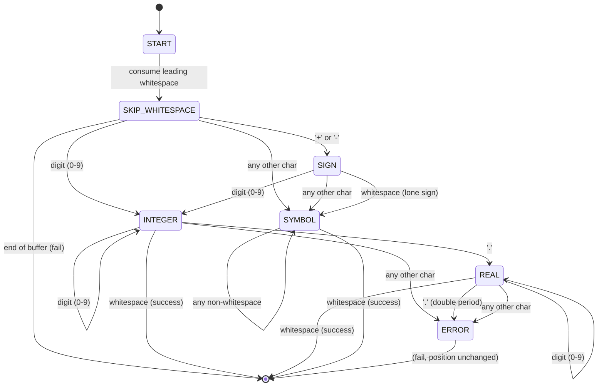

# Static Type Scanner State Machine

I had an AI generate the stress tests and upgrade the tests for the scanner implementation. It found a couple bugs too. Boy howdy!
It generated this doc to show my state machine. Its a bit more detailed than the one I drew on teh whiteboard and i like
how it broke down the tables to show the steps.

## Overview

The static type scanner reads a buffer and identifies three fundamental data types:

- **INTEGER**: Whole numbers with optional sign (`42`, `-17`, `+99`)
- **REAL**: Decimal numbers with optional sign (`3.14`, `-2.5`, `+0.001`)
- **SYMBOL**: Identifiers and non-numeric tokens (`alpha`, `foo-bar`, `var_123`)

## State Machine Diagram



## Type Definitions

| Type | Pattern | Examples | Invalid Examples |
|------|---------|----------|------------------|
| **INTEGER** | `[+-]?[0-9]+` | `0`, `42`, `-17`, `+99`, `123456` | `123x`, `1.`, `12a34` |
| **REAL** | `[+-]?[0-9]+\.[0-9]+` | `3.14`, `-2.5`, `+0.001`, `99.99` | `1.2.3`, `3.14x`, `.5` |
| **SYMBOL** | `[^ \t\n\r]+` | `alpha`, `foo-bar`, `var_123`, `+x`, `-abc` | _(none - any non-whitespace is valid)_ |

## Terminator Characters

Parsing stops when encountering whitespace:
- Space: `' '`
- Tab: `'\t'`
- Newline: `'\n'`
- Carriage return: `'\r'`

### Optional Stop Symbols

The scanner accepts an optional list of additional stop symbols that will terminate parsing without consuming the stop character. This allows callers to specify context-specific terminators like parentheses.

**Key Behaviors:**
- When whitespace is encountered: parsing stops and position advances past the whitespace
- When an optional stop symbol is encountered: parsing stops but position does NOT advance (stops at the symbol)
- Optional stop symbols must NOT include `.`, `+`, or `-` (these have special meaning in number parsing)
- Pass `NULL` for stop symbols to use default whitespace-only behavior

## Parsing Rules

### Sign Handling
When a `+` or `-` is encountered:
1. Look at the next character
2. If it's a digit → parse as INTEGER or REAL
3. If it's anything else (including whitespace) → parse as SYMBOL

### Integer to Real Transition
When parsing an INTEGER and encountering `.`:
1. Transition to REAL state
2. Continue consuming digits
3. If another `.` is encountered → ERROR

### Symbol Parsing
Symbols consume **all** non-whitespace characters until a terminator is reached. This includes:
- Letters, digits, punctuation, special characters
- Mixed content like `foo-123`, `var_name`, `test!@#`

## Frame-by-Frame Parsing Examples

### Example 1: Parsing `"alpha 42 -3.14"`

| Frame | Position | Current Char | State | Action | Result |
|-------|----------|--------------|-------|--------|--------|
| **Token 1: "alpha"** |
| 0 | 0 | `'a'` | START | Not whitespace, not digit, not sign → SYMBOL | - |
| 1 | 1 | `'l'` | SYMBOL | Non-whitespace → continue | - |
| 2 | 2 | `'p'` | SYMBOL | Non-whitespace → continue | - |
| 3 | 3 | `'h'` | SYMBOL | Non-whitespace → continue | - |
| 4 | 4 | `'a'` | SYMBOL | Non-whitespace → continue | - |
| 5 | 5 | `' '` | SYMBOL | Whitespace → terminate | ✓ SYMBOL: "alpha" (5 bytes) |
| **Token 2: "42"** |
| 6 | 5 | `' '` | START | Skip whitespace | - |
| 7 | 6 | `'4'` | START | Digit → INTEGER | - |
| 8 | 7 | `'2'` | INTEGER | Digit → continue | - |
| 9 | 8 | `' '` | INTEGER | Whitespace → terminate | ✓ INTEGER: "42" (2 bytes) |
| **Token 3: "-3.14"** |
| 10 | 8 | `' '` | START | Skip whitespace | - |
| 11 | 9 | `'-'` | START | Sign → check next | - |
| 12 | 10 | `'3'` | SIGN | Digit → INTEGER | - |
| 13 | 11 | `'.'` | INTEGER | Period → REAL | - |
| 14 | 12 | `'1'` | REAL | Digit → continue | - |
| 15 | 13 | `'4'` | REAL | Digit → continue | - |
| 16 | 14 | EOF | REAL | End of buffer → terminate | ✓ REAL: "-3.14" (5 bytes) |

### Example 2: Parsing `"  +x 99"` (sign as symbol)

| Frame | Position | Current Char | State | Action | Result |
|-------|----------|--------------|-------|--------|--------|
| **Token 1: "+x"** |
| 0 | 0 | `' '` | START | Skip whitespace | - |
| 1 | 1 | `' '` | START | Skip whitespace | - |
| 2 | 2 | `'+'` | START | Sign → check next | - |
| 3 | 3 | `'x'` | SIGN | Not digit → SYMBOL | - |
| 4 | 4 | `' '` | SYMBOL | Whitespace → terminate | ✓ SYMBOL: "+x" (2 bytes) |
| **Token 2: "99"** |
| 5 | 4 | `' '` | START | Skip whitespace | - |
| 6 | 5 | `'9'` | START | Digit → INTEGER | - |
| 7 | 6 | `'9'` | INTEGER | Digit → continue | - |
| 8 | 7 | EOF | INTEGER | End of buffer → terminate | ✓ INTEGER: "99" (2 bytes) |

### Example 3: Error Case `"1.2.3"` (double period)

| Frame | Position | Current Char | State | Action | Result |
|-------|----------|--------------|-------|--------|--------|
| 0 | 0 | `'1'` | START | Digit → INTEGER | - |
| 1 | 1 | `'.'` | INTEGER | Period → REAL | - |
| 2 | 2 | `'2'` | REAL | Digit → continue | - |
| 3 | 3 | `'.'` | REAL | Period (second) → ERROR | ✗ ERROR at position 3 |

**Error Details:**
- `start_position`: 0 (where token parsing began)
- `error_position`: 3 (where the invalid `.` was found)
- Scanner position: 0 (unchanged, allowing retry or recovery)

### Example 4: Error Case `"123x"` (invalid integer)

| Frame | Position | Current Char | State | Action | Result |
|-------|----------|--------------|-------|--------|--------|
| 0 | 0 | `'1'` | START | Digit → INTEGER | - |
| 1 | 1 | `'2'` | INTEGER | Digit → continue | - |
| 2 | 2 | `'3'` | INTEGER | Digit → continue | - |
| 3 | 3 | `'x'` | INTEGER | Not digit, not period, not whitespace → ERROR | ✗ ERROR at position 3 |

**Error Details:**
- `start_position`: 0
- `error_position`: 3 (where the invalid `'x'` was found)
- Scanner position: 0 (unchanged)

## Memory Layout Visualization

### Buffer: `"a +1 3.13"`

```
Byte Index:  0   1   2   3   4   5   6   7   8   9
Buffer:     [a] [ ] [+] [1] [ ] [3] [.] [1] [3] [\0]
             ^       ^       ^
             |       |       |
          Token 1  Token 2  Token 3
          SYMBOL   INTEGER  REAL
          "a"      "+1"     "3.13"
          (1 byte) (2 bytes)(4 bytes)
```

### Parsing Timeline

**After Token 1:**
- Parsed: `"a"` (SYMBOL)
- Scanner position: 1 (at the space after 'a')
- Data pointer: buffer[0]
- Byte length: 1

**After Token 2:**
- Parsed: `"+1"` (INTEGER)
- Scanner position: 4 (at the space after '1')
- Data pointer: buffer[2]
- Byte length: 2

**After Token 3:**
- Parsed: `"3.13"` (REAL)
- Scanner position: 9 (at end of buffer)
- Data pointer: buffer[5]
- Byte length: 4

## Key Implementation Notes

1. **No Memory Allocation**: The scanner never allocates memory. All data pointers reference locations within the original buffer.

2. **Position Advancement**: On successful parse, the scanner position advances past the consumed token (including trailing whitespace). On failure, position remains unchanged.

3. **Leading Whitespace**: Always consumed before attempting to identify a token type.

4. **Greedy Parsing**: The scanner consumes as many valid characters as possible for the current type before terminating.

5. **Error Recovery**: When an error occurs, the caller can examine `error_position` to understand exactly where parsing failed, enabling precise error reporting or recovery strategies.

## Optional Stop Symbols Examples

### Example: Parsing S-Expression `"(add 42 3.14)"`

Using stop symbols `['(', ')']`:

```
Byte Index:  0   1   2   3   4   5   6   7   8   9  10  11  12
Buffer:     [(] [a] [d] [d] [ ] [4] [2] [ ] [3] [.] [1] [4] [)]
             ^   ^               ^           ^               ^
             |   |               |           |               |
          Skip  Token 1        Token 2     Token 3      Stop here
                SYMBOL         INTEGER     REAL         (position 12)
                "add"          "42"        "3.14"
```

**Parsing Timeline:**

1. Start at position 1 (after `'('`)
2. Parse `"add"` → stops at space (position 4)
3. Skip whitespace, parse `"42"` → stops at space (position 7)
4. Skip whitespace, parse `"3.14"` → stops at `')'` (position 12, NOT consumed)
5. Scanner position is 12, pointing at `')'`

### Example: Stop Symbol vs Whitespace Behavior

**Input:** `"hello)world"`
**Stop Symbols:** `[')']`

| Token | Start Pos | End Pos | Result | Notes |
|-------|-----------|---------|--------|-------|
| "hello" | 0 | 5 | SUCCESS | Stopped at `)`, position = 5 (at `)`) |

**Input:** `"hello world"`
**Stop Symbols:** `NULL`

| Token | Start Pos | End Pos | Result | Notes |
|-------|-----------|---------|--------|-------|
| "hello" | 0 | 5 | SUCCESS | Stopped at space, position = 5 (past space) |

**Key Difference:** With stop symbols, the scanner position points AT the stop character. With whitespace, position is already past it.

